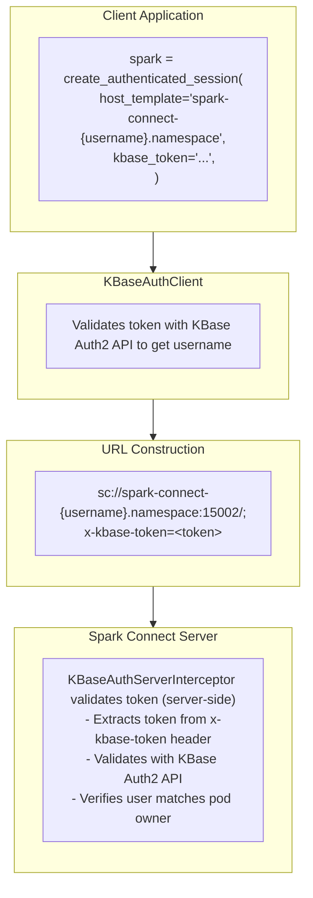

# spark-connect-kbase-auth Architecture

## Overview

This library provides KBase authentication for Apache Spark Connect clients. It automatically resolves the username from the KBase token to build the correct Spark Connect URL for multi-tenant environments, then passes the token via the URL for server-side validation.



## Core Components

### 1. Session Helpers

**File:** `session.py`

The main entry point for creating authenticated Spark Connect sessions.

| Function | Purpose |
|----------|---------|
| `create_authenticated_session()` | Create a full SparkSession with auth configured |
| `get_authenticated_spark()` | Shorthand wrapper around `create_authenticated_session()` |

**Key Features:**
- Automatically resolves `{username}` placeholder in host template
- Builds Spark Connect URL with token: `sc://host:port/;token=<token>`
- Supports environment variables for token and auth URL

---

### 2. KBaseAuthClient

**File:** `kbase_client.py`

HTTP client for the KBase Auth2 REST API. Used to validate tokens and retrieve user information.

**Responsibilities:**
- Validate tokens via `/api/V2/token` endpoint
- Get username from token (for URL construction)
- Get user info (display name, roles, etc.)
- Return structured `KBaseTokenInfo` objects

**Error Handling:**
- `KBaseAuthError` - Exception for auth errors
- Raises on invalid tokens, expired tokens, or network errors

---

## Authentication Flow

```
1. User calls create_authenticated_session()
   └── host_template="spark-connect-{username}.namespace", kbase_token="..."

2. Library ALWAYS validates token with KBase Auth2 (fail-fast)
   └── KBaseAuthClient.get_username(token) → "alice"
   └── Invalid/expired tokens fail immediately with KBaseAuthError

3. URL is constructed (with resolved username if {username} in template)
   └── sc://spark-connect-alice.namespace:15002/;use_ssl=false;x-kbase-token=<token>

4. SparkSession connects to server
   └── Token sent as 'x-kbase-token' metadata header
   └── (We avoid standard 'token' param to prevent PySpark auto-SSL upgrade)

5. Server-side validation (KBaseAuthServerInterceptor)
   ├── Extracts token from 'x-kbase-token' header
   ├── Validates token with KBase Auth2 service
   ├── Extracts username from validation response
   └── Verifies user matches pod owner (USER env var)

6. Connection established or rejected
```

## Configuration Options

| Option | Default | Description |
|--------|---------|-------------|
| `host_template` | `"spark-connect-{username}"` | Host template with `{username}` placeholder |
| `port` | `15002` | Spark Connect server port |
| `kbase_token` | `None` | KBase authentication token (falls back to env var) |
| `kbase_auth_url` | `None` | KBase Auth2 service URL (falls back to env var) |
| `use_ssl` | `False` | Enable SSL/TLS for connection (`scs://` protocol) |

## Environment Variables

| Variable | Description |
|----------|-------------|
| `KBASE_AUTH_TOKEN` | Default token if not provided explicitly |
| `KBASE_AUTH_URL` | Override default Auth2 service URL |

## Security Considerations

1. **Server-Side Validation** - All token validation is performed server-side by `KBaseAuthServerInterceptor`
2. **User Isolation** - Server verifies token username matches pod owner
3. **SSL/TLS** - Use `use_ssl=True` for production deployments
4. **Token Expiry** - Tokens are checked for expiration during server-side validation
5. **No Token Storage** - Tokens are held in memory only, never persisted
6. **URL Token Passing** - Token is passed via `x-kbase-token` URL parameter, which Spark Connect sends as a custom metadata header
